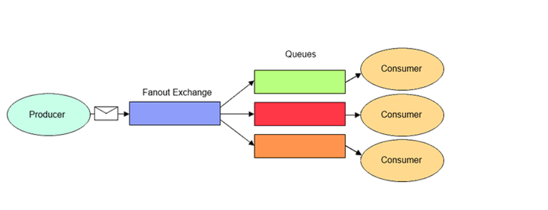
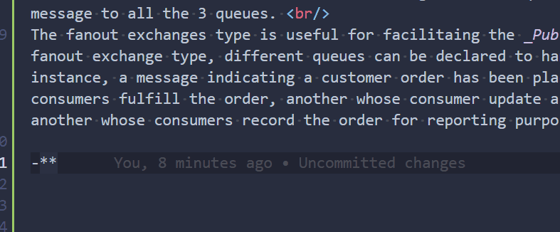

# Rabbitmq with .net

RabbitMQ is a message broker, It accept and forwards message. Some common jargon used in RabbitMQ are 
- **Producing**: it represent the service that sends message to rabbitmq. 
- **Queue**: it is where message send by producer will be stored. it's memory is bounded by the host's memory and disk limits. It acts as a messaging buffer where producer add message and consumer take those message and leaves acknowledgement. And there can be more than one queue in a messaging system and every queue has a unique name.
- **Consuming**: It represent the service that receive messages. This services will get the message from message broker and processes them.
- **Message Broker**: It is the intermediate elements who transmits messsage from senders to related receivers.
- **Router/Exchange**: It is the component in a message broker that decides which reveived message should be sent to which queue or queues, based on the configuration. Routing elements are called as "exchanges" in RabbitMQ.
- **Connection**: Real TCP connection between producer and message broker, or consumer and message broker.
- **Channel**: Virtual connection in real TCP connections. Actual message transmission is done over channels. There must be at least one channel between a producer and message broker or consumer and message broker in order to send and receive messages.
- **Binding**: Defines the relationship between an exachange and a queue. Binding definition may contain arguments like "routing key" and "headers" that are used to filter messages that will be sent to the bound queue. 

## Attributes of message: 
- **Routing key**: Single or multiple words that are used when distributing a message to the queues. 
- **Headers**: Collections of key-value pairs that are also used for routing messages and passing additional information.
- **Payload**: Actual data that a message carries.
- **Publishing TimeStamp**: Optional timestamp provided by publisher.
- **Expiration**: Life time for the message in a queue. After this time, the message considered to be "dead" which means the message is undeliverable. Unit is milliseconds.
- **Priority**: Priority of the message, between 0-255
- **Message Id**: Optional unique message id set by the publisher, to distinguish a message.
- **Correlation id**: Optional id for matching a request and a response in remote procedure call (RPC) scenarios.
- **Reply to**: Optional queue or exchange name used in request-response scenarios. 

## Attributes of Queue
- **Name**: Unique queue name, max 255 characters UTF-8 string.
- **Durable**: Whether to preserve or delete this queue when rabbitMQ restarts.
- **Auto Delete**: Whether to delete this queue if no one is subscribed to it.
- **Exclusive**: Used only by one connection and deleted when the connection is closed.
- **Max length**: Maximum number of waiting messages in a queue. Overflow behavior can be set as drop the oldest message or reject the new messages.
- **Max Priority**: Maximum number of priority value that this queue supports. (upto 255)
- **Message TTL**: Life time for each messages that is added to the queue. if the both message and queue has a TTL value, the lowest one will be chosen.
- **Dead-letter Exchange**: Name of the exchange that expired or dropped message will be automatically sent.
- **Binding Configuratins**: Associatinos between queues and exachanges. A queue must be bound to an exchange, in order to receive messages from it.

## Attributes of Exchanges
- **Name**: Unique name of the exchange.
- **Type**: type of exchange. it can be fanout, direct, topic or headers.
- **Auto Delete**: if "true", exchange will de deleted when there is no bound queue left.
- **Internal**: Internal exchange can only receive messages from other exchanges.
- **Alternate Exchange**: The name of the exchange thah unroutable messages will be sent.
- **Other Arguments(X-Argument)**: Other named arguemtns or settings that can be provided when creating an exchange. Their names starts with "x-", so these arguments are also called "x-arguments".

## Installing Rabbitmq

In this sample project, rabbitmq is installed in docker compose using docker-compose.yml file. If we see offical image of rabbitmq in docker hub there are many variant mostly ``docker pull rabbitmq:latest`` and ``docker pull rabbitmq:management``. As we can see one is rabbitmq and next is management, the only difference in these is that in managment the management plugin is already enable which will listen to port: 15672. By using managment plugin we are given web UI through which we can communicate with rabbitmq. Also in ``docker-compose.yml`` file, there is section which defines the username and password for the management UI.

## Creating Exchanges: 
Exchanges are the message router element of rabbitMQ. Producer doesn't send message directly to queues, they send to exchanges. Queues are bound to one or more exchanges with a binding definations or configurations. Exchanges receive messages from producers and route them to zero or more queues which are bound to them. Exchanges can route a message only to the queues that are bound to them. There are four types of exchanges: _Fanout_, _Direct_, _Topic_, _Headers_. There is at least one exchange in a rabbitmq system. this predefined exchange is called "default exchanges" and its type is "direct". Every newly created queue is implicitly bound to this exchange.  

- **Fanout**: The fanout exchanges types route message to all bound queues indiscriminately. If a routing key is provided, it will simply be ignored.  
  
All the consumer will receive the same message from the queues as the exchanges will send same message to all the 3 queues.  
The fanout exchanges type is useful for facilitaing the _Publish-Subscribe pattern_. When using the fanout exchange type, different queues can be declared to handle messages in different ways. For instance, a message indicating a customer order has been placed might be received by one queue whose consumers fulfill the order, another whose consumer update a read-only history of orders and yet another whose consumers record the order for reporting purposes.

